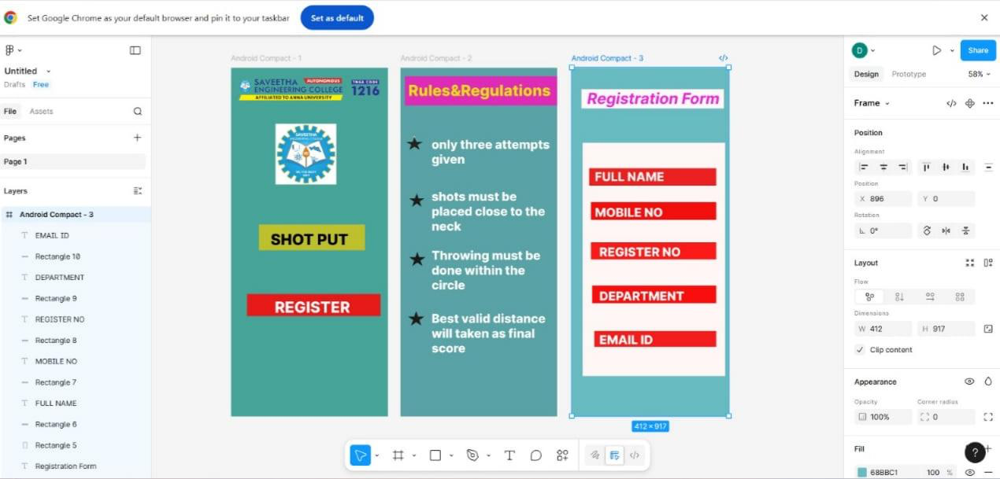

# Ex09 Event Registration Web Application

## Date:24/12/2025

## AIM:

To design, develop and deploy a web application for event registration.

## DESIGN STEPS:

### Step 1:

Create a new frame.

### Step 2:

Select any one preset size of your choice.

### Step 3:

Select the shapes you need.

### Step 4:

Import images as needed.

### Step 5:

Create pages based on your need and link them.

### Step 6:

Validate the HTML and CSS code.

### Step 6:

Publish the website in the given URL.

## DESIGN TOOL:

Figma

## CODE:

```
<!DOCTYPE html>
<html>
  <head>
    <meta name="viewport" content="width=device-width, initial-scale=1" />
    <meta charset="utf-8" />
    <link rel="stylesheet" href="globals.css" />
    <link rel="stylesheet" href="style.css" />
  </head>
  <body>
    <div class="android-compact">
      <div class="rectangle"></div>
      <div class="text-wrapper">SHOT PUT</div>
      <div class="div"></div>
      <div class="text-wrapper-2">REGISTER</div>
    </div>
  </body>
</html>
@import url("https://cdnjs.cloudflare.com/ajax/libs/meyer-reset/2.0/reset.min.css");
* {
  -webkit-font-smoothing: antialiased;
  box-sizing: border-box;
}
html,
body {
  margin: 0px;
  height: 100%;
}
/* a blue color as a generic focus style */
button:focus-visible {
  outline: 2px solid #4a90e2 !important;
  outline: -webkit-focus-ring-color auto 5px !important;
}
a {
  text-decoration: none;
}
.android-compact {
  background-color: #46a398;
  width: 100%;
  min-width: 412px;
  min-height: 917px;
  position: relative;
}

.android-compact .rectangle {
  position: absolute;
  top: 412px;
  left: 73px;
  width: 279px;
  height: 68px;
  background-color: #bdc02d;
}

.android-compact .text-wrapper {
  position: absolute;
  top: 427px;
  left: 104px;
  width: 232px;
  font-family: "Inter-ExtraBold", Helvetica;
  font-weight: 800;
  color: #000000;
  font-size: 40px;
  letter-spacing: 0;
  line-height: normal;
}

.android-compact .div {
  position: absolute;
  top: 595px;
  left: 42px;
  width: 351px;
  height: 58px;
  background-color: #e71818;
}

.android-compact .text-wrapper-2 {
  position: absolute;
  top: 605px;
  left: 115px;
  width: 210px;
  font-family: "Inter-ExtraBold", Helvetica;
  font-weight: 800;
  color: #ffffff;
  font-size: 40px;
  letter-spacing: 0;
  line-height: normal;
  white-space: nowrap;
}

page2

<!DOCTYPE html>
<html>
  <head>
    <meta name="viewport" content="width=device-width, initial-scale=1" />
    <meta charset="utf-8" />
    <link rel="stylesheet" href="globals.css" />
    <link rel="stylesheet" href="style.css" />
  </head>
  <body>
    <div class="android-compact">
      <div class="rectangle"></div>
      <div class="rules-regulations">Rules&amp;Regulations</div>
      
      
      <div class="text-wrapper">only three attempts given</div>
      
      <p class="div">shots must be placed close to the neck</p>
      
      <p class="p">Throwing must be done within the circle</p>
      
      <p class="text-wrapper-2">Best valid distance will taken as final score</p>
    </div>
  </body>
</html>
@import url("https://cdnjs.cloudflare.com/ajax/libs/meyer-reset/2.0/reset.min.css");
* {
  -webkit-font-smoothing: antialiased;
  box-sizing: border-box;
}
html,
body {
  margin: 0px;
  height: 100%;
}
/* a blue color as a generic focus style */
button:focus-visible {
  outline: 2px solid #4a90e2 !important;
  outline: -webkit-focus-ring-color auto 5px !important;
}
a {
  text-decoration: none;
}
.android-compact {
  background-color: #59a2a4;
  overflow: hidden;
  width: 100%;
  min-width: 412px;
  min-height: 917px;
  position: relative;
}

.android-compact .rectangle {
  position: absolute;
  top: 22px;
  left: 12px;
  width: 400px;
  height: 77px;
  background-color: #df2bb8;
}

.android-compact .rules-regulations {
  position: absolute;
  top: 35px;
  left: 21px;
  width: 411px;
  font-family: "Inter-ExtraBold", Helvetica;
  font-weight: 800;
  color: #e6df17;
  font-size: 40px;
  letter-spacing: 0;
  line-height: normal;
}

.android-compact .star {
  position: absolute;
  top: 179px;
  left: 31px;
  width: 11px;
  height: 5px;
}

.android-compact .img {
  position: absolute;
  top: 182px;
  left: 15px;
  width: 44px;
  height: 33px;
}

.android-compact .text-wrapper {
  position: absolute;
  top: 182px;
  left: 82px;
  width: 330px;
  font-family: "Inter-ExtraBold", Helvetica;
  font-weight: 800;
  color: #ffffff;
  font-size: 32px;
  letter-spacing: 0;
  line-height: normal;
}

.android-compact .star-2 {
  position: absolute;
  top: 330px;
  left: 23px;
  width: 40px;
  height: 35px;
}

.android-compact .div {
  position: absolute;
  top: 319px;
  left: 82px;
  width: 314px;
  font-family: "Inter-ExtraBold", Helvetica;
  font-weight: 800;
  color: #ffffff;
  font-size: 32px;
  letter-spacing: 0;
  line-height: normal;
}

.android-compact .star-3 {
  position: absolute;
  top: 484px;
  left: 23px;
  width: 43px;
  height: 37px;
}

.android-compact .p {
  position: absolute;
  top: 474px;
  left: 82px;
  width: 292px;
  font-family: "Inter-ExtraBold", Helvetica;
  font-weight: 800;
  color: #ffffff;
  font-size: 32px;
  letter-spacing: 0;
  line-height: normal;
}

.android-compact .star-4 {
  position: absolute;
  top: 640px;
  left: 20px;
  width: 43px;
  height: 38px;
}

.android-compact .text-wrapper-2 {
  position: absolute;
  top: 640px;
  left: 82px;
  width: 313px;
  font-family: "Inter-ExtraBold", Helvetica;
  font-weight: 800;
  color: #ffffff;
  font-size: 32px;
  letter-spacing: 0;
  line-height: normal;
}

page3

<!DOCTYPE html>
<html>
  <head>
    <meta name="viewport" content="width=device-width, initial-scale=1" />
    <meta charset="utf-8" />
    <link rel="stylesheet" href="globals.css" />
    <link rel="stylesheet" href="style.css" />
  </head>
  <body>
    <div class="android-compact">
      <div class="rectangle"></div>
      <div class="text-wrapper">Registration Form</div>
      <div class="div"></div>
      <div class="rectangle-2"></div>
      <div class="text-wrapper-2">FULL NAME</div>
      <div class="rectangle-3"></div>
      <div class="text-wrapper-3">MOBILE NO</div>
      <div class="rectangle-4"></div>
      <div class="text-wrapper-4">REGISTER NO</div>
      <div class="rectangle-5"></div>
      <div class="text-wrapper-5">DEPARTMENT</div>
      <div class="rectangle-6"></div>
      <div class="text-wrapper-6">EMAIL ID</div>
    </div>
  </body>
</html>
@import url("https://cdnjs.cloudflare.com/ajax/libs/meyer-reset/2.0/reset.min.css");
* {
  -webkit-font-smoothing: antialiased;
  box-sizing: border-box;
}
html,
body {
  margin: 0px;
  height: 100%;
}
/* a blue color as a generic focus style */
button:focus-visible {
  outline: 2px solid #4a90e2 !important;
  outline: -webkit-focus-ring-color auto 5px !important;
}
a {
  text-decoration: none;
}
.android-compact {
  background-color: #68bbc1;
  width: 100%;
  min-width: 412px;
  min-height: 917px;
  position: relative;
}

.android-compact .rectangle {
  position: absolute;
  top: 56px;
  left: 25px;
  width: 374px;
  height: 51px;
  background-color: #fef8f8;
}

.android-compact .text-wrapper {
  position: absolute;
  top: 56px;
  left: 40px;
  width: 360px;
  font-family: "Inter-BoldItalic", Helvetica;
  font-weight: 700;
  font-style: italic;
  color: #ed27d6;
  font-size: 40px;
  letter-spacing: 0;
  line-height: normal;
}

.android-compact .div {
  position: absolute;
  top: 197px;
  left: 28px;
  width: 374px;
  height: 614px;
  background-color: #fff6f6;
}

.android-compact .rectangle-2 {
  position: absolute;
  top: 264px;
  left: 45px;
  width: 334px;
  height: 46px;
  background-color: #ec1f1f;
}

.android-compact .text-wrapper-2 {
  position: absolute;
  top: 267px;
  left: 60px;
  width: 229px;
  font-family: "Inter-ExtraBold", Helvetica;
  font-weight: 800;
  color: #fcf3f3;
  font-size: 32px;
  letter-spacing: 0;
  line-height: normal;
}

.android-compact .rectangle-3 {
  position: absolute;
  top: 353px;
  left: 50px;
  width: 329px;
  height: 47px;
  background-color: #f50e0e;
}

.android-compact .text-wrapper-3 {
  position: absolute;
  top: 361px;
  left: 60px;
  width: 204px;
  font-family: "Inter-ExtraBold", Helvetica;
  font-weight: 800;
  color: #fef8f8;
  font-size: 32px;
  letter-spacing: 0;
  line-height: normal;
}

.android-compact .rectangle-4 {
  position: absolute;
  top: 459px;
  left: 50px;
  width: 329px;
  height: 45px;
  background-color: #fe1919;
}

.android-compact .text-wrapper-4 {
  position: absolute;
  top: 465px;
  left: 72px;
  width: 241px;
  font-family: "Inter-ExtraBold", Helvetica;
  font-weight: 800;
  color: #ffffff;
  font-size: 32px;
  letter-spacing: 0;
  line-height: normal;
}

.android-compact .rectangle-5 {
  position: absolute;
  top: 573px;
  left: 53px;
  width: 326px;
  height: 46px;
  background-color: #fa0c0c;
}

.android-compact .text-wrapper-5 {
  position: absolute;
  top: 581px;
  left: 72px;
  width: 261px;
  font-family: "Inter-ExtraBold", Helvetica;
  font-weight: 800;
  color: #ffffff;
  font-size: 32px;
  letter-spacing: 0;
  line-height: normal;
  white-space: nowrap;
}

.android-compact .rectangle-6 {
  position: absolute;
  top: 692px;
  left: 59px;
  width: 320px;
  height: 42px;
  background-color: #f41c1c;
}

.android-compact .text-wrapper-6 {
  position: absolute;
  top: 696px;
  left: 72px;
  width: 153px;
  font-family: "Inter-ExtraBold", Helvetica;
  font-weight: 800;
  color: #ffffff;
  font-size: 32px;
  letter-spacing: 0;
  line-height: normal;
  white-space: nowrap;
}
```

## OUTPUT:



## RESULT:

The program to design, develop and deploy a web application for event registration is completed successfully.

```

```
